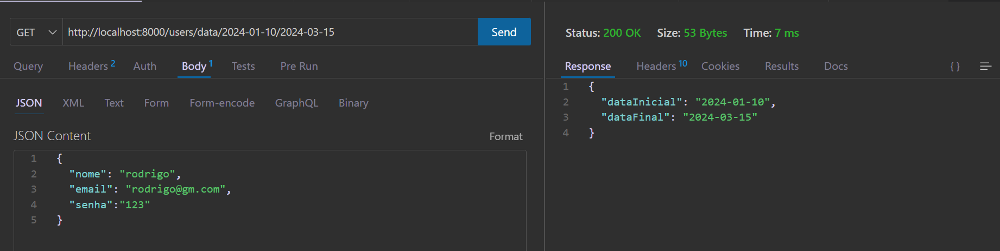
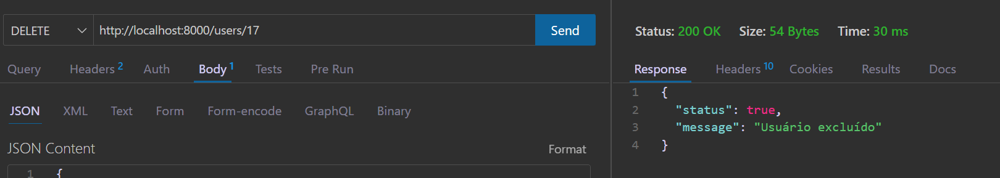
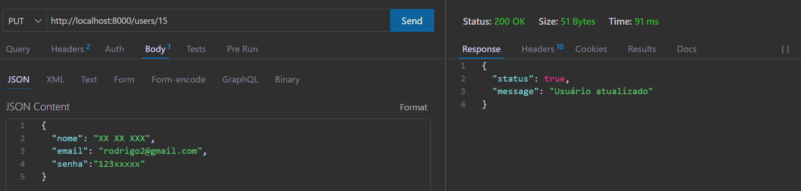
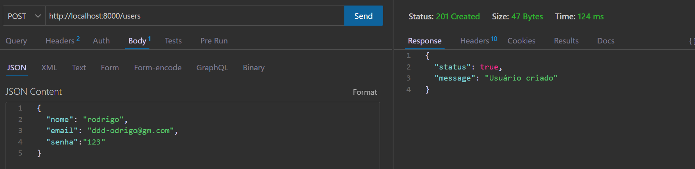
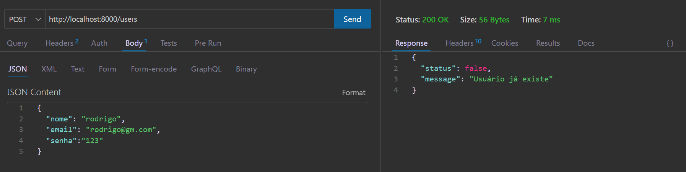
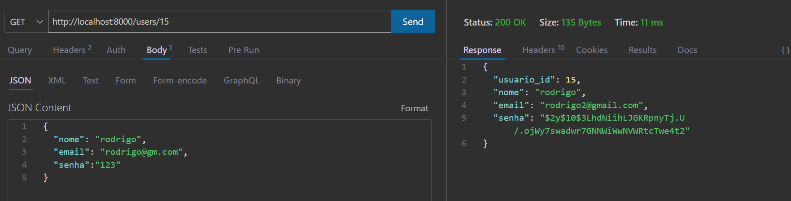
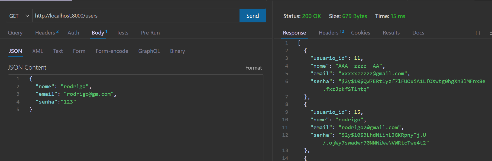

# FastApi - Projeto Backend

O **FastApi** é um projeto de backend que facilita a inclusão de rotas em uma aplicação REST, permitindo a criação rápida de endpoints CRUD com operações básicas. O projeto utiliza **anotações nos comentários (DocBlocks)** dos controladores para definir as rotas, inspirado no estilo do **FastAPI** em Python. O banco de dados utilizado é o **SQLite** para facilitar os testes e a configuração inicial. Este projeto não possui frontend, focando apenas no backend.

## Requisitos

- **PHP 7.4+** (recomendado PHP 8.0+)
- **Composer**
- **Banco de dados SQLite**
- **Postman** ou **Thunder Client** (ou qualquer cliente de API REST)

## Configuração

### Clone o repositório:

```bash
git clone https://github.com/faustinopsy/fastapi.git
```

### Instale as dependências do Composer:
```bash
composer install
```
### Navegue até a pasta src (cd src) e inicie o servidor:
```bash
php -S localhost:8000
```
### as classes controllers criadas precisam ter os comentários como o modelo:

```
<?php
namespace Fast\Api\Controllers;

use Fast\Api\Models\User;
use Fast\Api\Repositories\UserRepository;

class UserController {
    private $userRepository;

    public function __construct() {
        $this->userRepository = new UserRepository();
    }

    /**
     * @GET("/users")
     */
    public function getAllUsers() {
        // Retorna todos os usuários
    }

    /**
     * @GET("/users/{id}")
     */
    public function getUserById($id) {
        // Retorna um usuário pelo ID
    }

    /**
     * @POST("/users")
     */
    public function createUser() {
        // Cria um novo usuário
    }

    /**
     * @PUT("/users/{id}")
     */
    public function updateUser($id) {
        // Atualiza um usuário existente
    }

    /**
     * @DELETE("/users/{id}")
     */
    public function deleteUser($id) {
        // Deleta um usuário existente
    }
}
```
## Endpoints Disponíveis
O projeto inclui sete operações CRUD nas mesmas rotas, variando apenas o método HTTP. Veja abaixo os endpoints disponíveis:

- GET /users - Retorna todos os usuários
- GET /users/{id} - Retorna um usuário específico pelo ID
- GET /users/nome/rodrigo  - Retorna um usuário específico pelo nome
- GET /users/data/2024-01-10/2024-03-15  -pode receber dois argumentos para relatórios
- POST /users - Cria um novo usuário
- PUT /users/{id} - Atualiza um usuário existente pelo ID
- DELETE /users/{id} - Deleta um usuário existente pelo ID

### Exemplo de Requisição com JSON
Para testar os endpoints, você pode usar o Postman ou Thunder Client.

#### Exemplo para criar um novo usuário (POST /users):
- Método: POST
URL: http://localhost:8000/users

Body (raw JSON):
```
{
  "nome": "seunome",
  "email": "seunome@gmail.com",
  "senha": "1234"
}
```
#### Exemplo de Atualização de Usuário (PUT /users/{id}):
Método: PUT

URL: http://localhost:8000/users/1

Body (raw JSON):
```
{
  "nome": "nomeatualizado",
  "email": "emailatualizado@gmail.com",
  "senha": "nova_senha"
}

```
#### Exemplo de Deleção de Usuário (DELETE /users/{id}):
Método: DELETE

URL: http://localhost:8000/users/1


## Como Funciona o Roteamento com Anotações
As rotas são definidas diretamente nos métodos dos controladores usando anotações nos DocBlocks.
O DocBlockRouter é responsável por ler essas anotações e registrar as rotas.
Não é necessário registrar manualmente os controladores; o sistema carrega automaticamente todos os controladores presentes na pasta /Controllers.
As rotas podem conter parâmetros, como {id}, que serão passados como argumentos para os métodos.

### Exemplo de Parâmetros na Rota
```
/**
 * @GET("/users/{id}")
 */
public function getUserById($id) {
    // $id será o valor capturado da URL
}
```

## Dependências
O projeto utiliza a seguinte dependência:

phpdocumentor/reflection-docblock: Utilizada para interpretar as anotações nos DocBlocks.
- Instalação via Composer:
```
composer require phpdocumentor/reflection-docblock
```
## Autoloading com Composer
Certifique-se de que o composer.json está configurado para o autoloading das classes:
```
{
    "autoload": {
        "psr-4": {
            "Fast\\Api\\": "src/"
        }
    }
}
```
## Estrutura do index.php
O arquivo index.php é responsável por inicializar o roteamento e processar as requisições:
```
<?php
namespace Fast\Api;

use Fast\Api\Http\HttpHeader;
use Fast\Api\Rotas\DocBlockRouter;

require_once '../vendor/autoload.php';

// Define os cabeçalhos HTTP padrão
HttpHeader::setCabecalhosPadrao();

// Trata requisições OPTIONS para CORS
if ($_SERVER['REQUEST_METHOD'] === 'OPTIONS') {
    http_response_code(204);
    exit();
}

// Obtém o método HTTP e a URI da requisição
$metodoHttp = $_SERVER['REQUEST_METHOD'];
$uri = $_SERVER['REQUEST_URI'];

// Cria uma instância do roteador
$roteador = new DocBlockRouter();

// Define o caminho base e o namespace para os controladores
$caminhoControladores = __DIR__ . '/../src/Controllers';
$namespaceBase = 'Fast\\Api\\Controllers';

// Obtém todas as classes de controladores dinamicamente
$classesControladoras = obterClassesControladoras($caminhoControladores, $namespaceBase);

// Passa todas as classes de controladores para o roteador
foreach ($classesControladoras as $classeControladora) {
    $roteador->passaControlador($classeControladora);
}

// Resolve a rota com base no método HTTP e URI
$roteador->resolve($metodoHttp, $uri);

// Função para obter todas as classes de controladores
function obterClassesControladoras($caminhoControladores, $namespaceBase) {
    $classesControladoras = [];

    $iterador = new \RecursiveIteratorIterator(
        new \RecursiveDirectoryIterator($caminhoControladores)
    );

    foreach ($iterador as $arquivo) {
        if ($arquivo->isFile() && $arquivo->getExtension() === 'php') {
            // Obtém o caminho do arquivo relativo ao caminho dos controladores
            $caminhoRelativo = substr($arquivo->getPathname(), strlen($caminhoControladores));
            // Remove os separadores de diretório iniciais
            $caminhoRelativo = ltrim($caminhoRelativo, DIRECTORY_SEPARATOR);
            // Remove a extensão '.php' do arquivo
            $caminhoRelativo = substr($caminhoRelativo, 0, -4);
            // Substitui os separadores de diretório pelos separadores de namespace
            $parteNomeClasse = str_replace(DIRECTORY_SEPARATOR, '\\', $caminhoRelativo);
            // Monta o nome completo da classe, incluindo o namespace
            $nomeClasse = $namespaceBase . '\\' . $parteNomeClasse;

            // Verifica se a classe existe (autoload)
            if (!class_exists($nomeClasse)) {
                // Inclui o arquivo para carregar a classe
                require_once $arquivo->getPathname();
            }

            // Se a classe existe após inclusão, adiciona à lista de classes controladoras
            if (class_exists($nomeClasse)) {
                $classesControladoras[] = $nomeClasse;
            }
        }
    }

    return $classesControladoras;
}

```
## Arquivo: Rotas/DocBlockRouter.php (comentado em detalhes)
este arquivo é dependente do Reflection e do phpDocumentor
https://phpdoc.org/
https://www.php.net/manual/en/book.reflection.php
```
<?php
namespace Fast\Api\Rotas;

use ReflectionClass;
use ReflectionMethod;
use phpDocumentor\Reflection\DocBlockFactory;
class DocBlockRouter {
    private array $rotas = [];
    public function passaControlador(string $classeControladora) {
        // Cria uma reflexão da classe controladora
        $reflexaoControladora = new ReflectionClass($classeControladora);
        // Obtém todos os métodos públicos da classe controladora
        $metodos = $reflexaoControladora->getMethods(ReflectionMethod::IS_PUBLIC);
        // Cria uma instância da fábrica de DocBlocks
        $fabricaDocBlock = DocBlockFactory::createInstance();
        // Percorre cada método público da classe controladora
        foreach ($metodos as $metodo) {
            // Obtém o comentário do DocBlock do método
            $comentarioDoc = $metodo->getDocComment();
            if ($comentarioDoc) {
                // Cria um objeto DocBlock a partir do comentário
                $docBlock = $fabricaDocBlock->create($comentarioDoc);
                $metodosHttp = ['GET', 'POST', 'PUT', 'DELETE', 'PATCH', 'OPTIONS'];
                // Verifica se o DocBlock possui alguma das tags HTTP
                foreach ($metodosHttp as $metodoHttp) {
                    if ($docBlock->hasTag($metodoHttp)) {
                        // Obtém a primeira tag correspondente ao método HTTP
                        $tagRota = $docBlock->getTagsByName($metodoHttp)[0];
                        // Obtém o conteúdo da descrição da tag (ex: '("/usuarios")')
                        $conteudo = $tagRota->getDescription()->render();
                        // Extrai o caminho da rota a partir do conteúdo da tag
                        preg_match('/\("(.*)"\)/', $conteudo, $correspondencias);
                        $caminho = $correspondencias[1] ?? '';
                        // Armazena a rota no array de rotas, associando o método HTTP, caminho e ação
                        $this->rotas[$metodoHttp][$caminho] = [$classeControladora, $metodo->getName()];
                    }
                }
            }
        }
    }
    public function resolve($metodoHttp, $uri) {
        // Verifica se existem rotas para o método HTTP solicitado
        if (!isset($this->rotas[$metodoHttp])) {
            http_response_code(405);
            echo json_encode(['status' => false, 'message' => 'Método não permitido']);
            exit();
        }
        // Obtém o caminho da URI (sem query strings)
        $uri = parse_url($uri, PHP_URL_PATH);
        // Percorre cada rota registrada para o método HTTP
        foreach ($this->rotas[$metodoHttp] as $rota => $acao) {
            // Substitui os parâmetros da rota por expressões regulares nomeadas
            $padrao = preg_replace_callback('/\{([a-zA-Z_][a-zA-Z0-9_]*)\}/', function ($matches) {
                $nomeParametro = $matches[1];
                // Para parâmetros genéricos, permite qualquer sequência que não contenha '/'
                return '(?P<' . $nomeParametro . '>[^/]+)';
            }, $rota);
            // Define o padrão como uma expressão regular completa
            $padrao = '#^' . $padrao . '$#u';
            // Verifica se a URI corresponde ao padrão da rota
            if (preg_match($padrao, $uri, $correspondencias)) {
                // Cria uma instância da classe controladora
                $instanciaControladora = new $acao[0]();
                $nomeMetodo = $acao[1];
                // Filtra os parâmetros nomeados capturados na expressão regular
                $parametros = array_filter(
                    $correspondencias,
                    fn($chave) => is_string($chave),
                    ARRAY_FILTER_USE_KEY
                );
                // Obtém os dados do corpo da requisição (se houver)
                $dados = json_decode(file_get_contents('php://input'), true);
                // Obtém os parâmetros esperados pelo método através da reflexão
                $metodoRefletido = new ReflectionMethod($instanciaControladora, $nomeMetodo);
                $parametrosMetodo = $metodoRefletido->getParameters();
                $argumentos = [];
                // Prepara os argumentos a serem passados para o método, na ordem correta
                foreach ($parametrosMetodo as $parametro) {
                    $nome = $parametro->getName();
                    if (isset($parametros[$nome])) {
                        $argumentos[] = $parametros[$nome];
                    } elseif ($nome === 'dados') {
                        $argumentos[] = $dados;
                    } else {
                        $argumentos[] = null;
                    }
                }
                // Chama o método da controladora com os argumentos obtidos
                return call_user_func_array([$instanciaControladora, $nomeMetodo], $argumentos);
            }
        }
        // Se nenhuma rota corresponder, retorna erro 404
        http_response_code(404);
        echo json_encode(['status' => false, 'message' => 'Rota não encontrada']);
        exit();
    }
}

```









## Licença
Este projeto está licenciado sob a MIT License.

